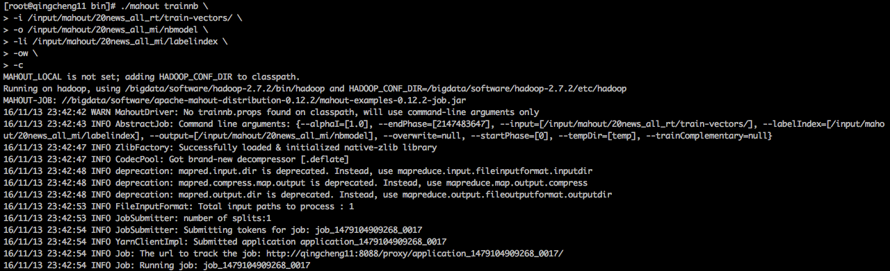

##<<贝叶斯算法应用示例--新闻分类示例>>
####一、下载数据集，并上传到hdfs  
Download and extract the 20news-bydate.tar.gz from the 20newsgroups dataset to the working directory.   
1.下载数据集
```
wget http://101.96.10.65/people.csail.mit.edu/jrennie/20Newsgroups/20news-bydate.tar.gz
```
2.解压数据集
```
tar -zxvf 20news-bydate.tar.gz
```

3.精简数据集  
删除一部分数据，不需要那么大的数据集。如果你想对全部数据进行计算，这一步就可以省略了。
```   
1.删除train部分的冗余数据
    cd 20news-bydate-train
    rm -rf rec* talk* sci* comp*
    
2.删除test部分的冗余数据
    cd ../20news-bydate-test
    rm -rf rec* talk* sci* comp*
```

4.上传数据集到HDFS
```    
1.在hdfs上创建目录
    hadoop fs -mkdir  /input/mahout/20news_all
    
2.上传数据到hdfs
    hadoop fs -put -p  ./20news-bydate-test/  /input/mahout/20news_all/
    hadoop fs -put -p  ./20news-bydate-train/  /input/mahout/20news_all/
```

5.HDFS执行效果
      

####二、将数据集转化为序列文件       
Convert the full 20 newsgroups dataset into a < Text, Text > SequenceFile.   
执行命令：
```
${MAHOUT_HOME}/bin/mahout seqdirectory \
-i /input/mahout/20news_all \
-o /input/mahout/20news_all_seq
```

shell执行效果：
    
hadoo yarn web执行效果：
    
hadoo hdfs web执行效果：
   

查看序列文件的内容  
```
${MAHOUT_HOME}/bin/mahout seqdumper -i /input/mahout/20news_all_seq/part-m-00000 
```


   

####三、将序列文件转化为向量
Convert and preprocesses the dataset into a < Text, VectorWritable > SequenceFile containing term frequencies for each document.   
执行命令：
```
${MAHOUT_HOME}/bin/mahout seq2sparse \
-i /input/mahout/20news_all_seq \
-o /input/mahout/20news_all_vec \
-wt tfidf \
-lnorm \
-nv 
```

shell执行效果：
    
hadoo yarn web执行效果：
    
hadoo hdfs web执行效果：
    

####四、将向量拆分为训练集和测验集
Split the preprocessed dataset into training and testing sets.  
执行命令：
```
${MAHOUT_HOME}/bin/mahout split \
-i /input/mahout/20news_all_vec/tfidf-vectors \
-tr /input/mahout/20news_all_rt/train-vectors \
-te /input/mahout/20news_all_rt/test-vectors \
-xm sequential \
-rp 20 \
-seq \
-ow 

其中参数的意义如下：
•	-tr训练集     
•	-te测试集
•	-rp参数设定的是测试数据集占总数据集的百分比，以下代码设定为20%！   
```

shell执行效果：
    
hadoo hdfs web执行效果：
    


####五、训练分类器
Train the classifier.  
1.开始训练  
这个过程将进行多次迭代，就想是进行多次训练来熟悉一种模型一样。等待时间比较长，需要一点耐心。。。  
执行命令：
```
${MAHOUT_HOME}/bin/mahout trainnb \
-i /input/mahout/20news_all_rt/train-vectors  -el  \
-o /input/mahout/20news_all_mi/nbmodel \
-li /input/mahout/20news_all_mi/labelindex \
-ow \
-c
```

shell执行效果：
    
hadoo yarn web执行效果：
    
hadoo hdfs web执行效果：
    

2.检验训练结果  
2.1.查看训练出来的模型：
```
hadoop fs -ls  /input/mahout/20news_all_mi/nbmodel 
```
   

2.2. 查看生成的索引:   
a.使用Hadoop命令
```
hadoop fs -text /input/mahout/20news_all_mi/labelindex
```
   
b.使用mahout命令
```
${MAHOUT_HOME}/bin/mahout seqdumper -i  /input/mahout/20news_all_mi/labelindex
```
         


####六、测试分类器
Test the classifier.   
执行命令：
```
${MAHOUT_HOME}/bin/mahout testnb \
-i /input/mahout/20news_all_rt/test-vectors \
-m /input/mahout/20news_all_mi/nbmodel \
-l /input/mahout/20news_all_mi/labelindex \
-o /input/mahout/20news_all_testing \
-ow \
-c
```
shell执行效果：
    
    
hadoo yarn web执行效果：
    
hadoo hdfs web执行效果：
    
查看结果文件内容效果：
```
${MAHOUT_HOME}/bin/mahout seqdumper -i /input/mahout/20news_all_testing/part-m-00000
```
  

####七、参考文献          
  
1.贝叶斯算法参考链接
```
http://mahout.apache.org/users/classification/bayesian.html
```

2.新闻分类参考链接
```
http://mahout.apache.org/users/classification/twenty-newsgroups.html
```

--------


